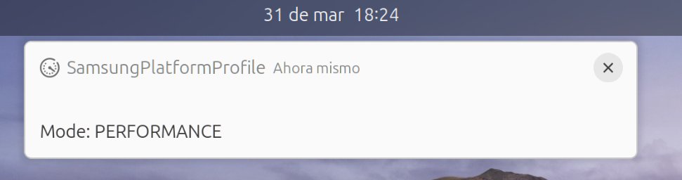

# samsung-profile-monitor
Companion for [samsung-galaxybook-extras](https://github.com/joshuagrisham/samsung-galaxybook-extras/tree/main)

This simple program is a companion for samsung-galaxybook-extras that notifies the current platform profile state after pressing Fn+F11, similar to how Windows does. It uses Gnome gdbus notifications to achieve this functionality.

## Installation

```bash
curl -sSL https://raw.githubusercontent.com/kity-linuxero/samsung-profile-monitor/refs/heads/main/install.sh | bash
```

## Functionally

When user press `Fn` + `F11` appear a notification with profile.



## Check status

```bash
systemctl --user status samsung_platform_profile_monitor
```

## Uninstall

```bash
curl -sSL https://raw.githubusercontent.com/kity-linuxero/samsung-profile-monitor/refs/heads/main/install.sh --uninstall| bash
```